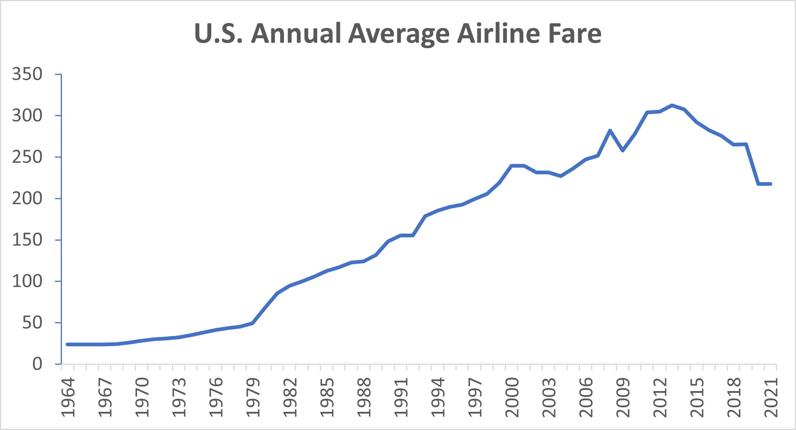
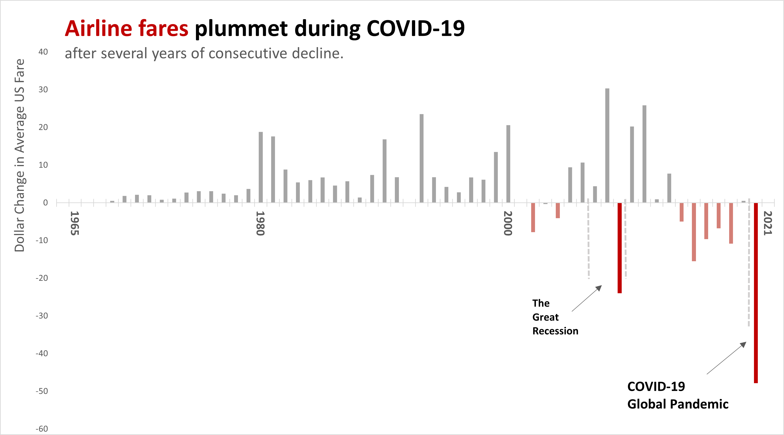

# Storytelling with Excel Using Airline Data

In this analysis, I used Excel to look at the average airline fare in the U.S. over the past 50 years. The data used was gathered from the Bureau of Labor Statistics query tool (source: https://beta.bls.gov/dataViewer/view/timeseries/CUSR0000SETG01).

## A Basic Line Chart (no storytelling)

First, I used Excel to create a basic line chart that showed the U.S. annual average fare from 1964 - 2021. This was as simple as selecting the data, clicking "Recommended Charts" and selecting a line chart which Excel auto-populated. 

You can see the results are semi-adequate... but they certainly aren't anything to write home about. 

## A Better Way: Storytelling with Data

After looking at the line chart, I saw two trends I wanted to highlight. The first was the decline in fare price after The Great Recession in 2007 - 2009 (reduced fare was observed in 2009), and the second was the huge reduction in fare during COVID-19 in 2020. 

Because I wanted to highlight the declines in the fare prices, I created an additional column for "Unit Change" which was a calculation of the difference between one year and the year before it. 

I put these into an absolute difference bar chart to better visualize the price change from year to year.

Next, there was still cleaning up to do. 

To draw the reader's attention where I wanted it to go, I focused on reducing noise in the visualization. I got rid of grid lines, reduced the x-tick labels (in this case the labels where years are displayed), greyed out the bars I was not focused on, used the color red to highlight the story in the graph, annotated two significant dips (The Great Recession and COVID-19), and used the title as an opportunity to explicitly tell the story. 

Here's the final result:

