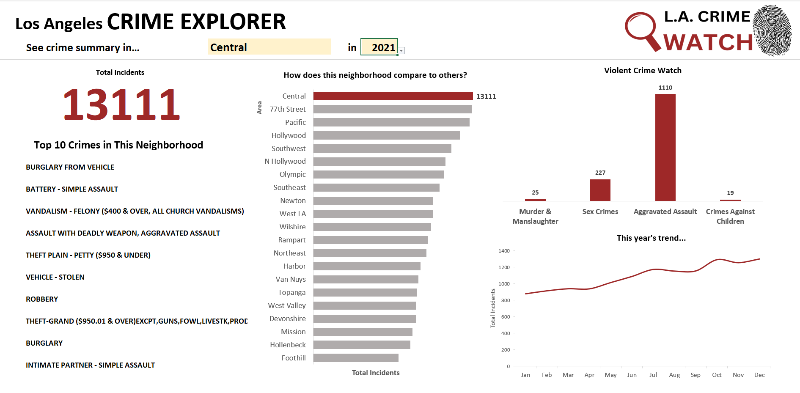

# Exploratory Dashboard -  "L.A. Crime Watch"

Using [crime incident data from data.gov](https://catalog.data.gov/dataset/crime-data-from-2020-to-present), I created this exploratory dashboard in Excel. The dashboard is dynamic and allows users to filter by neighborhood and year. All visuals are formula based and continue to work anytime data is added to the file.

Formulas Used:

- COUNTIFS
- RANK.EQ
- INDEX
- MATCH
- IF
- SUMIFS