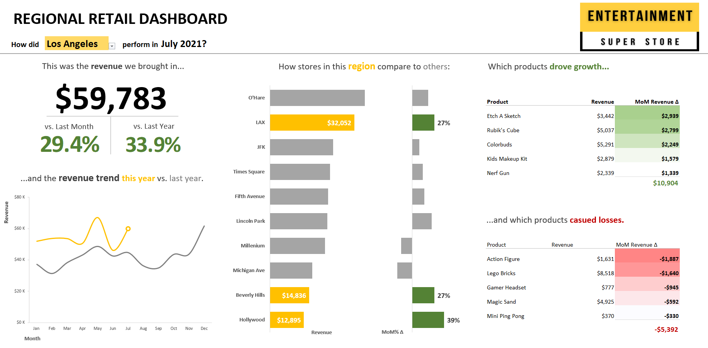

# RETAIL DASHBOARD

I made this dashboard in Excel with mock sales data from 'Entertainment Superstore.' 

The dashboard provides insight on KPI's including total revenue, month-over-month and year-over-year comparisons, revenue trends, comparative store revenue, products driving growth, and products driving losses. 

### See A Screenshot of the Dashboard Below

   
  
  
  
**Download the excel file from GitHub to interact with the dashboard**