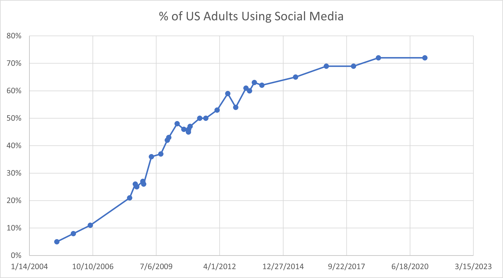
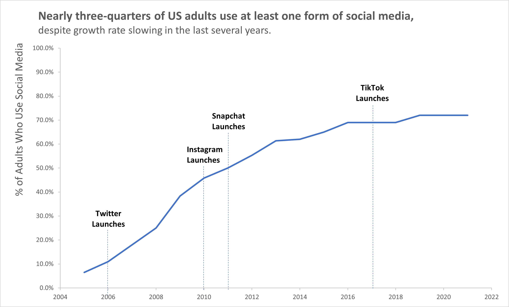

# Storytelling with Data - US Social Media Users

For this analysis, I used data gathered by the Pew Research Center (source: https://www.pewresearch.org/internet/fact-sheet/social-media/)

The first chart I made was the 'recommended chart' by Excel, which was an auto-populated line chart. You can see the results below:

## Before Storytelling

To improve this chart with storytelling in mind, I did the following:

- Removed 'noise' by removing the background grid
- Smoothed the line instead of using the line with markers (in this case the markers were distracting and didn't add to the story.)
- Used the YEAR() function to extract the year from the date, then used the UNIQUE() and AVERAGEIF() functions to find the average percentage in each year (this prevents displaying duplicate year information, which in this case was unnecessary)
- Added tick marks on the outside of both axes to aid readability
- Labeled the Y-axis near the top of the graph so the audience does not have to search for it 
- Used the main chart title to explicitly tell a story
- Annotated the launches of major social media platforms

This was the end result:

## After Storytelling

